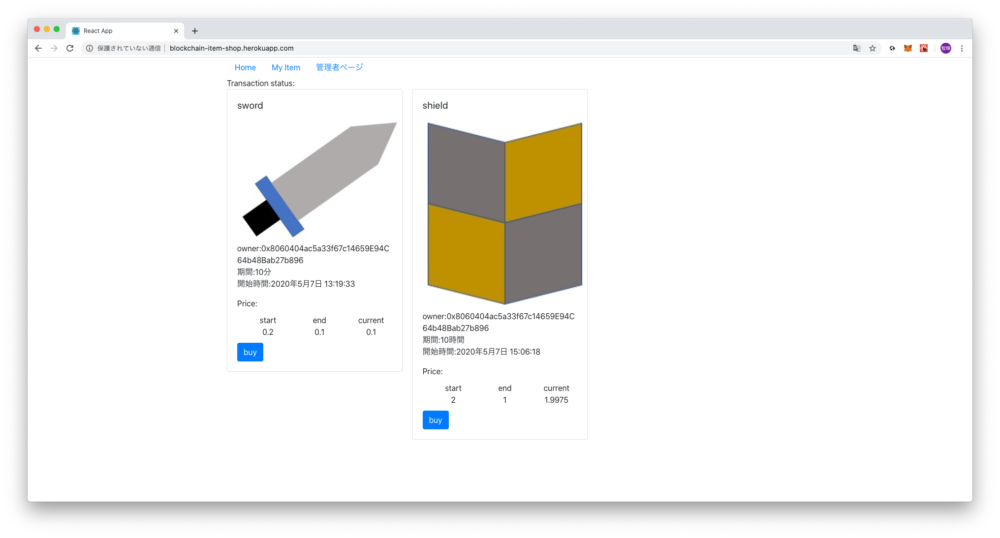
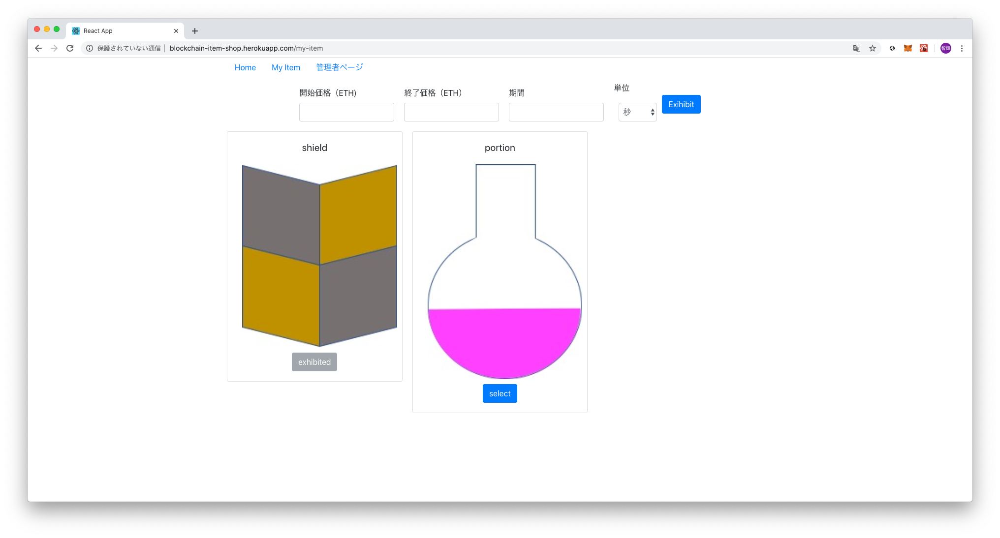
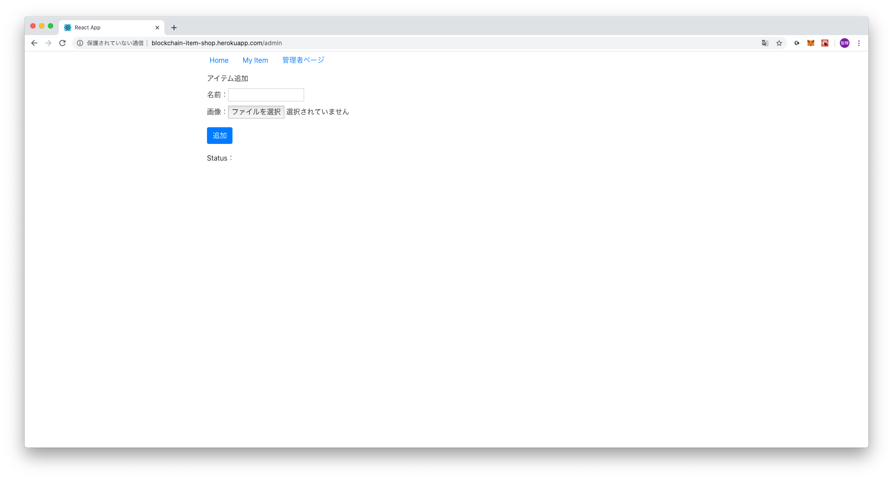
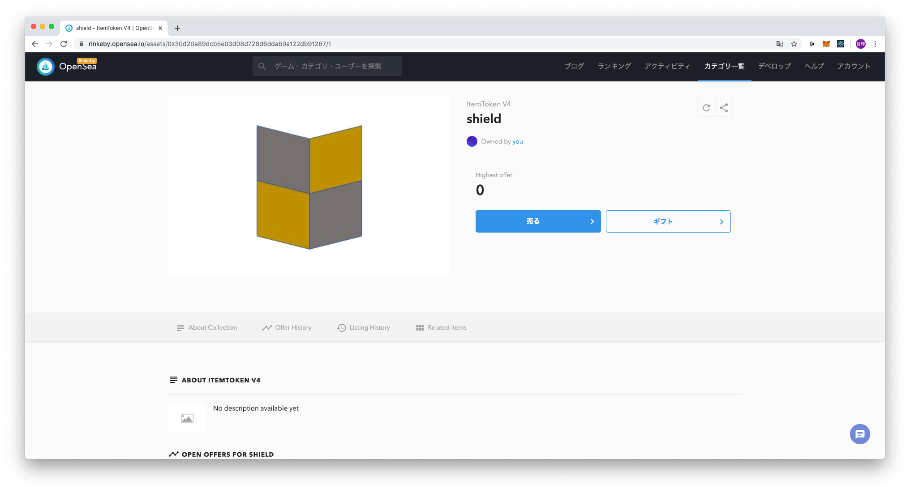

# ページ紹介
## Home
オークションが一覧表示される。オークションはダッチオークション形式で行われる。


## My Item
自分の保持しているアイテムが確認できる。
アイテム、開始価格、終了価格、期間を指定して出品することができる。


## 管理者ページ
アイテムの追加を行う。管理者のみが実行できる。


## Open Seaでも取引が可能


# ディレクトリ構成図
```
root/
┣ client/: クライアント側
┃ ┣ public/
┃ ┗ src/: reactのソースファイル
┃　　┣ admin/: 管理者ページ
┃　　┣ common/: 共通で使うもの
┃　　┣ contracts/: solidityのartifacts
┃　　┣ home/：オークションのページ
┃　　┗ my_item/：My Itemのページ
┣ contracts/: solidityファイル
┣ document/: このReadmeで使用している画像
┣ migrations/: マイグレーションファイル
┗ test/: Solidityのテストファイル
```

# 開発環境
- node v11.15.0
- npm 6.7.0
- yarn 1.22.4
- ipfs 0.5.1
- truffle v5.1.23 
- gnache 2.4.0


# 利用したプログラミング言語
- Solidity
- javascript

# 利用したライブラリ・フレームワーク
## サーバー
- truffle: ブロックチェーン開発環境（ただし、テストには使っていない）
- truffle-hdwallet-provider: truffle-configで使用
- @openzeppelin/contracts: ERC721, Ownableのコントラクトを使用
- mocha: テストフレームワーク
- @openzeppelin/test-environment: テストで使用
- @openzeppelin/test-helper: テストで使用

## フロント
- React:create-react-appを用いて作成
- ipfs-http-client: ipfsをjavascriptで扱うライブラリ
- react-bootstrap: bootstrapをreactで扱うライブラリ
- react-router-dom: ルーティング
- @drizzle/store: web3の状態管理を行うredux
- @web3/react-plugin: drizzleContextが使える

# How to run
## 環境変数
### フロント
- REACT_APP_INFURA_URL：ブロックチェーンURL
infuraのrinkebyだと"wss://rinkeby.infura.io/ws/v3/"+"PROJECT ID"
- REACT_APP_NETWORK_TYPE："private" | "rinkeby"
- REACT_APP_IPFS_HOST：ipfsに使用するホスト
- REACT_APP_IPFS_PROTOCOL："http" | "https"
- REACT_APP_IPFS_BASE_URL：ERC721に登録するベースURI

### infuraへのデプロイ
- INFURA_ACCESS_TOKEN：デプロイに使用するアカウントの秘密鍵
- INFURA_DEPLOY_ACCOUNT_PRIVATE_KEY：infuraのrinkebyだと"PROJECT ID"

## ipfs, truffle, ganacheのインストール方法(Mac)
```
# ipfs
$ brew install ipfs
# truffle
$ npm install -g truffle
# ganache
brew cask install ganache
```

## コントラクト
```
$ yarn install
# コンパイル
truffle compile
# ローカル環境にデプロイ
$ truffle migrate --network development
# rinkebyネットワークにデプロイ
$ truffle migrate --network rinkeby
# テスト
npm test
```

## フロント
```
$ cd client
$ yarn install
$ npm start
```

## ipfsの起動(mac)
```
$ ipfs init
$ brew services start ipfs
# CORSの設定
$ ipfs config --json API.HTTPHeaders.Access-Control-Allow-Origin '["*"]'
# 止める場合
$ brew services stop ipfs
```

# テストネット環境構築手順
## infura.ioのアカウント作成
1. アカウント登録
2. 新規プロジェクト作成
3. curlで確認(https://infura.io/docs/ethereum/json-rpc/eth_blockNumber)

```
curl -X POST -H "Content-Type: application/json" --data '{"jsonrpc": "2.0", "id": 1, "method": "eth_blockNumber", "params": []}' "https://rinkeby.infura.io/v3/61fef65cbb4f4ef5aece697bcb40a9bf"
{"jsonrpc":"2.0","id":1,"result":"0x603f28"}
```

## faucet 受け取り
1. 受け取りたいアドレスをコピーし，tweetする
2. 以下のサイトでtweetしたアドレスを貼り付け
https://faucet.rinkeby.io/

## deploy手順
1. truffle-hdwallet-providerをインストール
```
npm install --save-dev truffle-hdwallet-provider
```
2. truffle-configを修正
```javascript
rinkeby: {
  provider: function () {
    return new HDWalletProvider(
      deployAccount, //秘密鍵
      "https://rinkeby.infura.io/v3/" +  accessToken
    );
  },
  network_id: 4,
  gas: 5000000
}
```

3. デプロイ
```
truffle migrate --network rinkeby
```

4. etherscanで確認

## 参考サイト
https://tech.pepabo.com/2017/12/06/erc20-token-on-ropsten/

# 各テストネットの特徴
https://qiita.com/bokuGucci/items/0fa9b7e840bbc61a4b91
> ||Ropsten |Kovan |Rinkeby |
> |:-:|:-:|:-:|:-:|
> |承認方法  |PoW |PoA |PoA |
> |利用可能ノード  |geth, parityの両方 |parity |geth |
> |コイン入手方法 | マイニング, faucet |faucet |faucet|
> |ブロック生成間隔 |30秒 |4秒 |15秒 |
> |必要なデータ容量 | 15GB(*1) | 13GB(*1) | 6GB(*1) |
> (*1) 2018年4月時点

POAについて
https://medium.com/the-dapps-community/イーサリアムにおけるコンセンサスアルゴリズムは何が結局ベストなのか-729ad817e8d1

gethとparity
https://tomokazu-kozuma.com/difference-between-geth-and-parity-of-ethereum-blockchain-node/

# heroku環境構築手順
1. アカウント登録
2. Appを作成する．アプリ名がURLとなる
3. デプロイ設定をする．
    1. Deployment method:Github
    2. レポジトリの指定
    3. `Enable Automatic Deploys`をクリック 
4. buildpacksで以下の2つを追加（順番注意）
    - https://github.com/lstoll/heroku-buildpack-monorepo.git
    - heroku/nodejs
5. 環境変数の設定
    1. heroku CLIのインストール
    ```
    brew tap heroku/brew && brew install heroku
    ```
    2. herokuへのログイン
    ```
    heroku login
    ```
    3. 環境変数の設定
    ```
    heroku config:set APP_BASE=client -a blockchain-item-shop
    ```
※ herokuでは，package.jsonのdevDependenciesはインストールされないので注意
